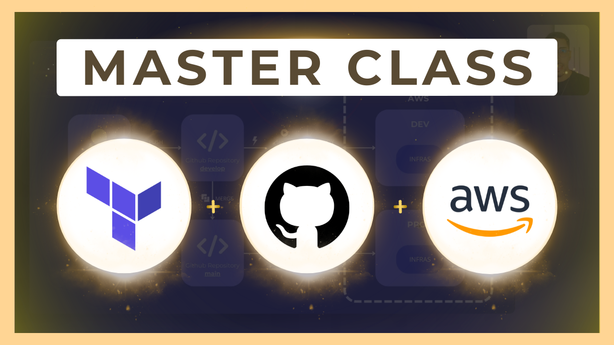
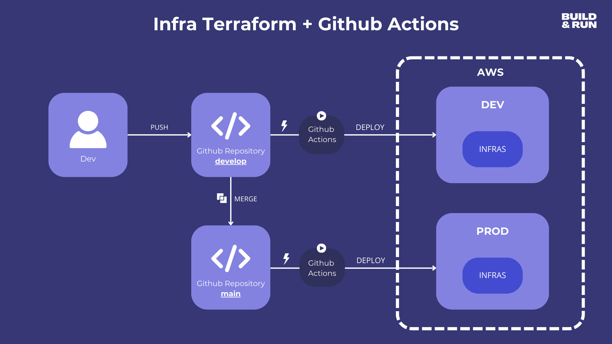
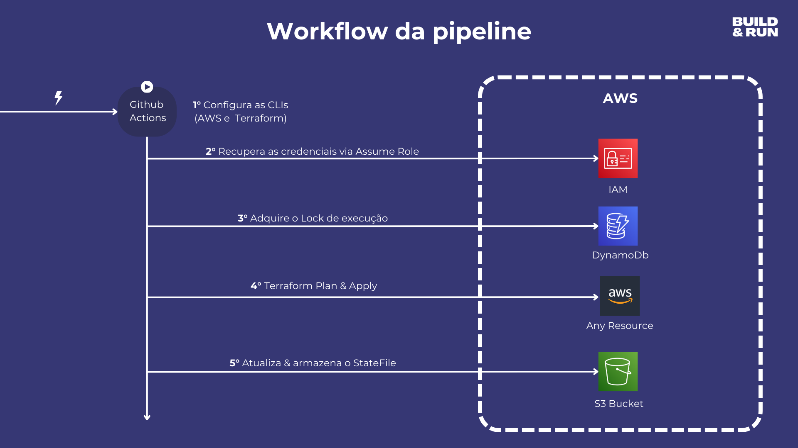

     

<h3 align="center">
  Pipeline de Infraestrutura (AWS + Terraform + Github Actions + Multi Env)
</h3>

  
  

## 📦 Sobre o projeto

Este repositório contém uma estrutura de pipeline para automação de infraestrutura usando **Terraform**, **GitHub Actions**, **AWS** e suporte a múltiplos ambientes (ex: dev, staging, prod).

> ⚠️ Projeto baseado em tutorial produzido pelo canal [Build & Run](https://www.youtube.com/@buildrun-tech). Todos os créditos de conteúdo e estrutura à equipe do canal, que tem contribuído imensamente com a comunidade de tecnologia.

---

## 🔁 Fluxo da Pipeline

     

     

---

## 🚀 Como começar?

1. Crie o Identity Provider do GitHub na sua conta AWS
2. Crie uma IAM Role na AWS com permissões mínimas de S3 e DynamoDB
3. Crie um bucket S3 com versionamento habilitado
4. Crie uma tabela no DynamoDB com a partition key chamada `LockID`
5. Clone este repositório
6. Configure os arquivos do workflow conforme o seu ambiente
7. Faça um push na branch e observe a mágica acontecer 😄

---

## 🛠️ Tecnologias utilizadas

- **Terraform**
- **GitHub Actions**
- **AWS (S3, DynamoDB, IAM, OIDC)**
- **Shell Script**

---

## 🤝 Agradecimentos

Este projeto é fortemente inspirado no conteúdo educacional disponibilizado pelo canal **Build & Run**. A iniciativa do canal em compartilhar conhecimento de qualidade é essencial para a evolução da comunidade tech. 🙏

---

## 📄 Licença

Este projeto está sob a licença MIT.
